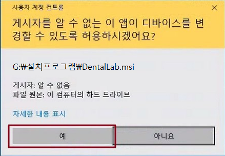

# 1.설치

설치 파일은 협회에서 배포된 인증USB 안에 담겨있습니다. 또한 인터넷을 통해 최신의 프로그램을 다운로드 받으실 수 있습니다.

## - USB를 통한 설치

배포된 인증USB의 `설치프로그램` 폴더에 setup.exe를 선택 후 실행하시면 설치가 시작됩니다.


# 2.설치 과정

## - 설치프로그램 (setup.exe) 실행





## - 설치 후 바탕화면, 바로가기 생성


# 3.프로그램 실행
## - 바탕화면 바로가기 실행


## - 탐색기 실행
```yml
프로그램 설치 경로 : C:\DentalLab\
실행 파일명 : DentalLab.exe
```

