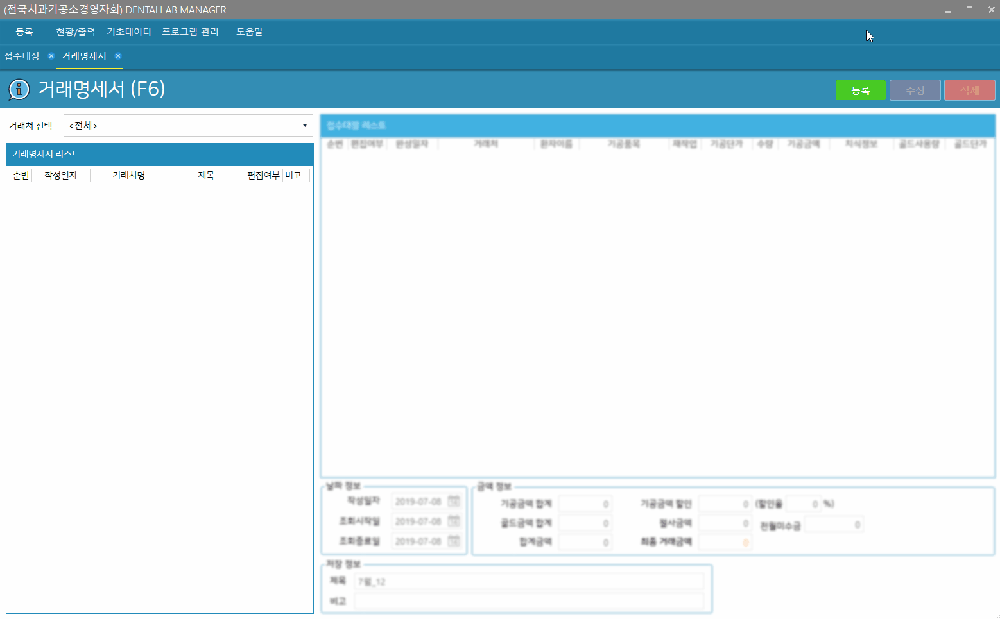

# 거래명세서
* 기능 : 거래명세서 등록, 인쇄 / 계산서 발행

---
##### 거래명세서 등록 순서
1. 화면 우측 상단의 `등록`버튼 클릭
2. 거래처 선택 > 기간 설정 > 조회
3. 리스트 내용 확인
4. 화면 하단의 `저장`버튼 클릭  ( => `거래명세서인쇄` 버튼 활성화 )

이후 내용 변경이 필요한 경우

5. 거래명세서의 항목 추가/삭제, 내용변경, 거래금액 변경 후 `저장` 클릭
6. `거래명세서인쇄` 버튼으로 거래명세서 내용 확인하기

---
##### 등록예시
