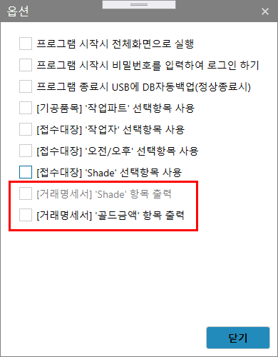
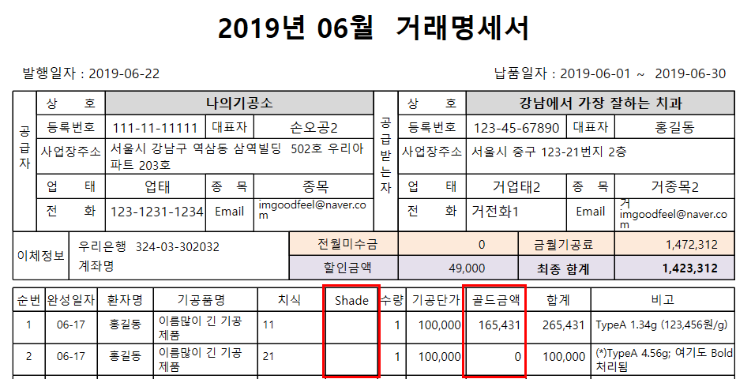

# [거래명세서]
* 기능 : 거래명세서 등록, 인쇄 / 계산서 발행

---
#### [1.3.0.4 Update] Shade, 골드금액 출력여부 변경하기
1. Shade, 골드금액 출력 여부를 결정하기 위해서는 아래의 이미지에서 같이 옵션 메뉴에서 해당 항목을 체크.

2. [옵션]메뉴에서 선택 여부에 따라 아래의 두 항목이 출력되거나 되지 않는다.
3. (주의사항) 아래의 이미지와 같이 '골드금액'이 존재하는 상황에서 해당 항목을 출력하지 않을 경우라도 금액은 원래대로 출력됨.

#### 거래명세서 등록 순서
1. 화면 우측 상단의 `등록`버튼 클릭
2. 거래처 선택 > 기간 설정 > 조회
3. 리스트 내용 확인
4. 화면 하단의 `저장`버튼 클릭  ( => `거래명세서인쇄` 버튼 활성화 )

이후 내용 변경이 필요한 경우

5. 거래명세서의 항목 추가/삭제, 내용변경, 거래금액 변경 후 `저장` 클릭
6. `거래명세서인쇄` 버튼으로 거래명세서 내용 확인하기

---
##### 등록예시
