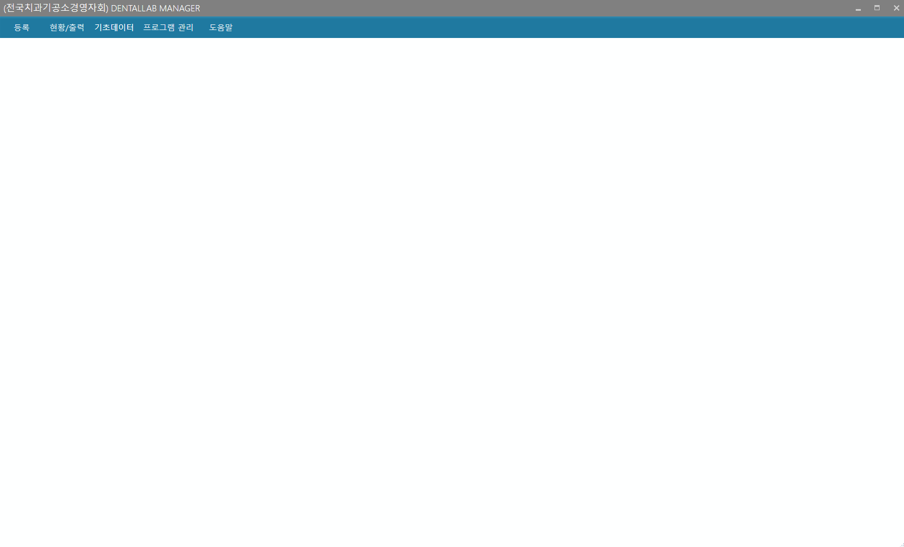

# [거래처]
* 기능 : 거래처 등록/수정/삭제

---
## 거래처 관리항목
* **거래처명만 등록하면 사용가능**
* 다만 거래명세서인쇄 기능을 정상적으로 이용하기 위해서는 대표자명, 등록번호, 업태, 종목 등의 기타 정보가 필요합니다.
* 단축키 용도 : 접수대장등록시 빠른 선택을 위한 용도로 등록

---
##### 거래처 등록
* 1.`등록`버튼 클릭 
* 2.정보입력
* 3.`저장`버튼 클릭

---
##### 거래처 수정
* 1.왼쪽 리스트에서 수정을 원하는 거래처 선택
* 2.`수정`버튼 클릭
* 3.거래처 정보 수정
* 4.하단의 `저장`버튼 클릭

---
##### 거래처 삭제
* 1.왼쪽 리스트에서 삭제를 원하는 거래처 선택
* 2.`삭제`버튼 클릭
* 3.삭제확인 팝업창에서 `확인` 클릭

