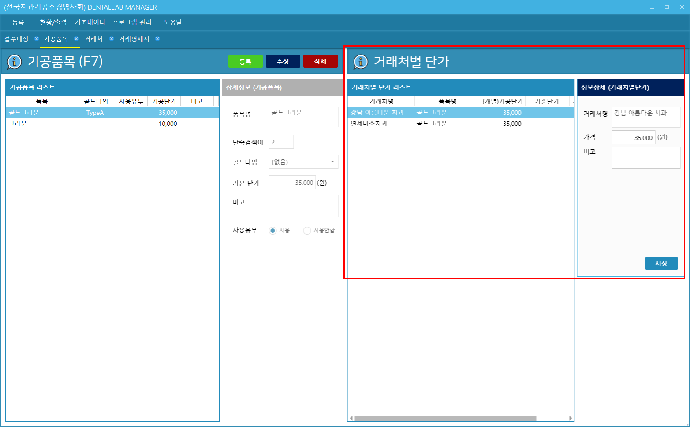
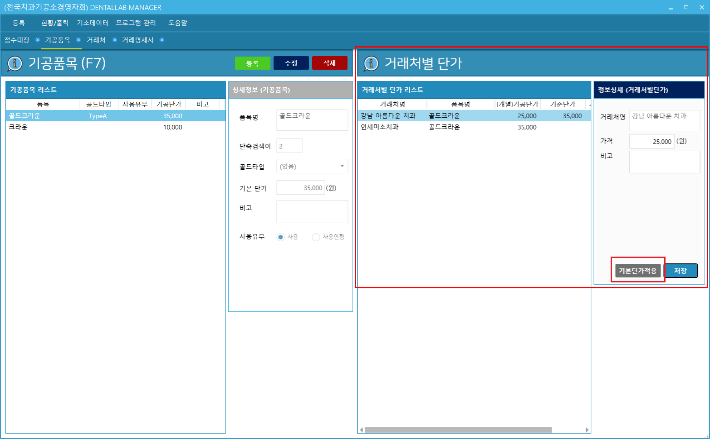

# 거래처별 단가
* 기능 : 기공품목에 대해 거래처별로 단가를 관리

---
##### 거래처별로 다른 단가 지정
* 왼쪽 거래처목록에서 거래처선택 후 "가격"정보 입력 후 저장 버튼을 클릭합니다.

---
##### 지정된 단가를 기준단가(일반적인 단가)로 변경
* 어느 한 거래처가 기준단가가 아닌 개별단가로 지정된 경우 그 거래처를 선택하면 "기준단가적용" 버튼이 보입니다.  그 버튼을 클릭하게 되면 해당 거래처의 단가는 일반적인 단가로 적용됩니다.

