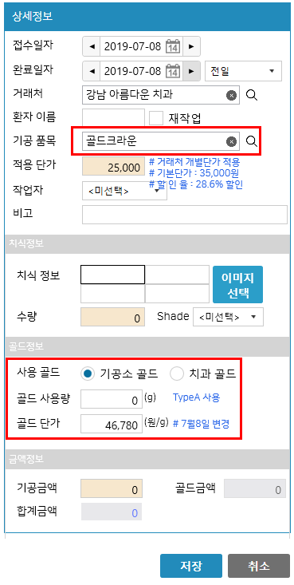

# [골드타입]
* 기능 : 기공품목에 사용하는 골드타입의 관리
* [참고사항] 보통은 "골드함량"에 따라 골드타입을 분리하여 등록합니다.

---
##### 화면 예시
* [참고사항] `최근 골드단가` 항목은 입력하는 것이 아닌 접수대장 등록시 사용된 가격이 자동으로 기억되어 다음 접수대장 등록시 사용됩니다.

---
##### 골드타입 이용안내
* 기공품목에 따라 골드타입이 지정되거나 지정되지 않을 수 있습니다. (판단 기준은 골드의 사용유무입니다)

* 골드를 사용하는 품목에 대해서는 사전에 `골드타입`을 등록하여 기공품목 등록시 해당 골드타입을 지정합니다.

* [참고사항] 골드타입을 지정한 기공품목에 대해서는 접수대장 등록시 `기공소골드`, `치과골드`를 선택할 수 있는 항목이 노출됩니다. (아래 이미지 참고)

---
##### ** > 기공품목에서 [골드타입] 설정 **

##### ** > 접수대장에서 [골드] 정보 입력 **

