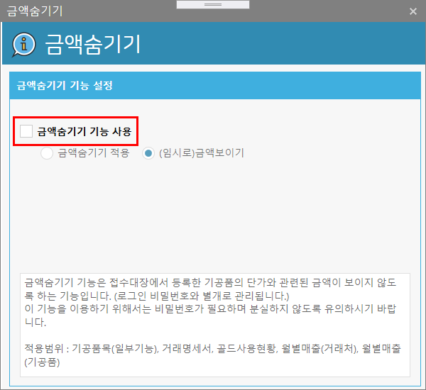
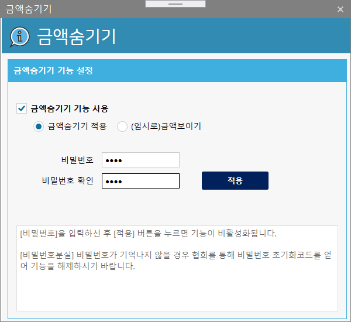
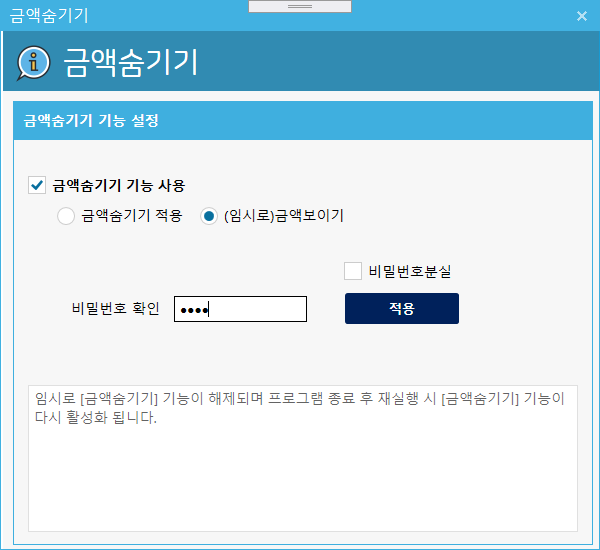

# [금액숨기기]
* 기능 : 접수대장에서 금액과 관련된 항목의 값이 화면에 출력되는 것을 차단하는 기능.
        비밀번호 설정이 필요함. (단 프로그램실행시 사용하는 로그인 비밀번호와는 다른 비밀번호임)
         

### 금액숨기기 활성화
1. 아래의 이미지와 같이 [금액숨기기 기능 사용]을 체크합니다.
2. 숨기기 기능을 활성화 시키기 위해서는 비밀번호를 새로 입력하여합니다. (분실 주의)

### 금액숨기기 임시 해제
1. 일시적으로 금액을 확인하기 위해서는 (임시로)금액보이기를 선택한다. 
2. 해제에 필요한 비밀번호를 입력한다.
3. 임시적인 해제이기 때문에 프로그램 종료 후 다시 금액숨기기가 활성화 된다.

### 금액숨기기 (완전히) 해제하기
1. 아래의 이미지처럼 [금액숨기기 기능 사용]을 해제한다.
2. 해제를 위해서는 처음 활성화 시킬때 설정한 비밀번호를 입력한다.
3. 프로그램 종료 후에는 금액숨기기 기능이 비활성됨(금액보이기 동작)

### 비밀번호 분실하였을 경우
1. 설정시 입력한 비밀번호를 분실하였을 경우 협회로 연락하거나 게시판에 해당 내용을 등록한다.
2. 프로그램 관리자가 해당 비밀번호를 초기활 시킬 수 있는 코드를 유선 혹은 메일로 알려드립니다.
3. 해당 해제 코드를 입력하면 [금액숨기기]기능이 해제 됩니다.
4. (주의) 비밀번호 초기화 코드는 매일 변경되어 하루 동안만 유효합니다.