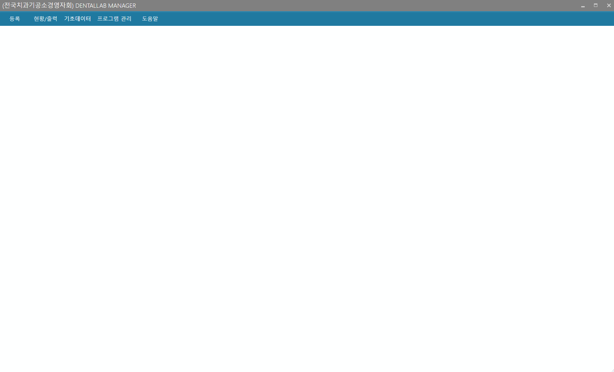
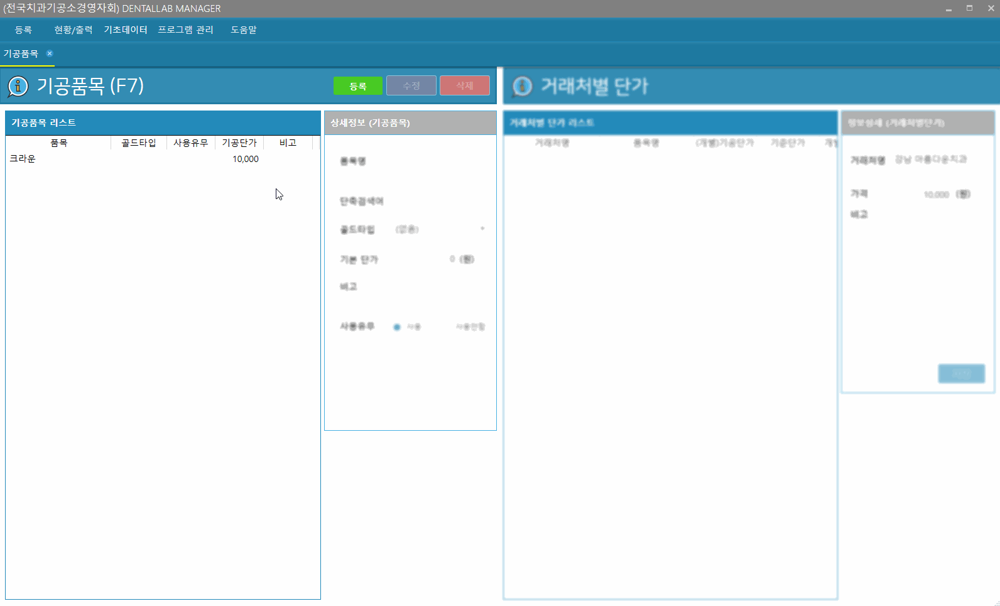

# 기공품목

* 기능 : 기공품목의 등록/수정/삭제, ** 거래처별 단가지정 **
* ( [거래처별 단가](../거래처별단가) 지정 기능은 해당 설명서 참고)

---
##### 기공품목 관리항목
* **기공품목명만 등록하면 사용가능**
* 다만 접수대장 등록시 원할한 사용을 위해 기본단가 입력이 필요함.
* 단축키 용도 : 접수대장등록시 빠른 선택을 위한 용도로 등록

---
##### 기공품목 등록1 (**골드 미사용 품목**)
* 1.등록버튼 클릭 
* 2.정보입력
* 3.저장버튼 클릭

---
##### 기공품목 등록2 (**골드 사용 품목**)
* 1.등록버튼 클릭 
* 2.품목 정보 등록
* 3.하단의 [골드타입 관리] 클릭
* 4.골드타입 등록 (기초데이터 메뉴의 골드타입에서도 등록 가능)
* 5.기공품명 입력 후 방금 등록한 골드타입을 선택
* 6.저장 버튼 클릭

---
##### 거래처 수정
* 1.왼쪽 리스트에서 수정을 원하는 거래처 선택
* 2.수정버튼 클릭
* 3.거래처 정보 수정
* 4.하단의 저장버튼 클릭

---
##### 거래처 삭제
* 1.왼쪽 리스트에서 삭제를 원하는 거래처 선택
* 2.삭제버튼 클릭
* 3.삭제확인 팝업창에서 확인 클릭

