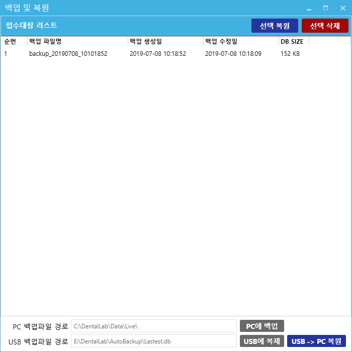

# 백업_복원
* 기능 : 데이터베이스의 백업 및 복원

# 버튼 설명
1. `선택복원` - 이전에 백업된 항목을 리스트에서 선택 후 해당 버튼을 클릭할 경우 선택된 데이터베이스를 기준으로 자료가 복원됩니다.
2. `선택삭제` - 리스트에서 선택된 백업 항목을 삭제합니다. (오래되어 불필요한 백업은 주기적으로 삭제해 주세요)
3. `PC에 백업` - 현재 사용중인 데이터베이스의 복사본을 PC에 백업합니다.
4. `USB에 복제` - 현재 사용중인 데이터베이스의 복사본을 USB에 백업합니다.
5. `USB->PC복원` - USB에 저장되어 있는 데이터베이스를 PC로 복원합니다. 

