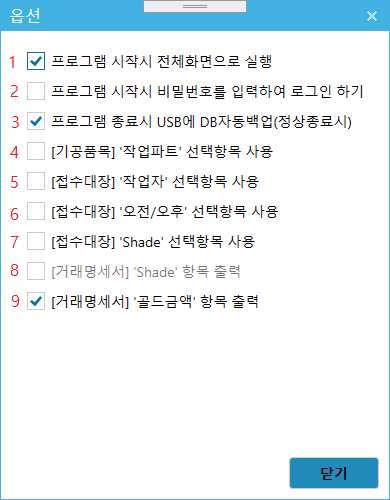

# 옵션
* 기능 : 프로그램 사용에 필요한 옵션을 설정

## 항목설명
1. 프로그램 실행 직후 프로그램의 화면 크기가 최대창으로 실행됩니다.
2. 프로그램 보안 강화를 위하여 프로그램 사용시 비밀번호를 입력하도록 하는 기능을 활성화 시킵니다.
3. USB에 최신의 데이터베이스를 백업 - 프로그램이 정상적으로 종료시 PC에서 사용했던 데이터베이스를 USB에 복제합니다.
4. 접수대장 등록시 기공품을 제작할 `작업파트`를 설정할 수 있도록 합니다. (사용전에 `기초데이터`메뉴에서 `작업파트` 등록 필요)
5. 접수대장 등록시 기공품을 제작할 `작업자`를 설정할 수 있도록 합니다. (사용전에 `기초데이터`메뉴에서 `작업자` 등록 필요)
6. 완성품 출고 시점을 `오전/오후`로  설정할 수 있도록 합니다.
7. 접수대장 등록시 기공품의 `Shade`를 설정할 수 있도록 합니다. (사용전에 `기초데이터`메뉴에서 `쉐이드` 등록 필요)
 

