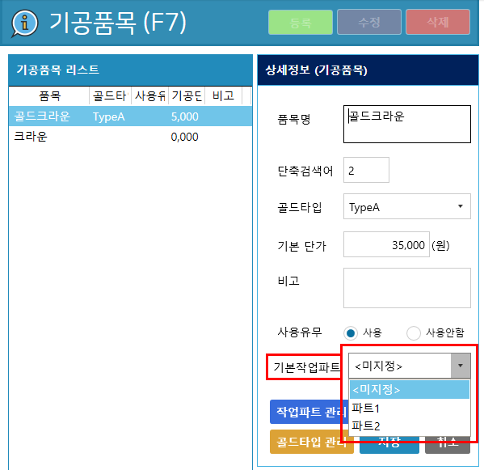
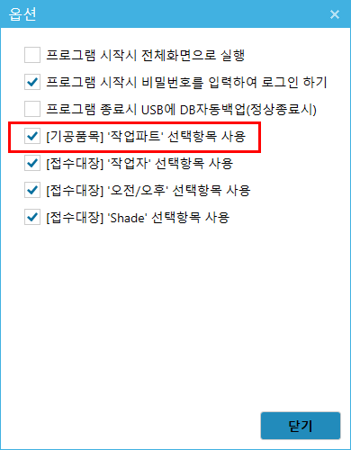
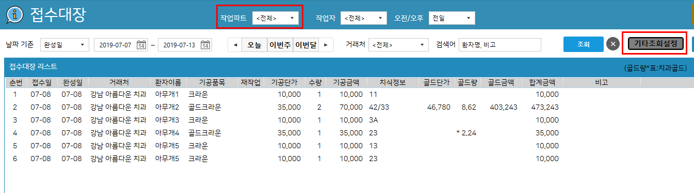
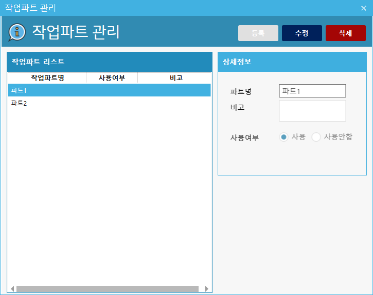

# 작업파트
* 기능 - 기공품목 등록시 작업파트를 지정할 수 있는 데이터를 관리
 

---
##### 작업파트 기능 활성화
* 위의 화면처럼 `접수대장` 등록항목에 `작업파트`를 추가하기 위해서는 `옵션`메뉴에서 해당 기능을 활성화 시켜야 함 
* 아래 이미지 참고

---
##### 활용방법 : 작업리스트를 작업파트로 조회

---
##### 화면 예시
