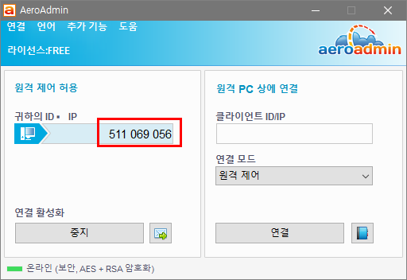
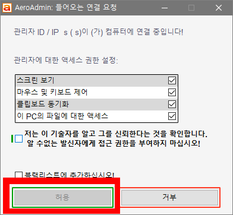

# 원격지원

## [ >>> 원격프로그램 내려받기 싸이트 이동 <<<](https://www.aeroadmin.com/kr/)

* 싸이트 이동 후 아래의 이미지처럼 다운로드 이미지 클릭으로 원격프로그램 다운로드 받기

# 사용방법

1. 위에 링크된 프로그램을 다운로드 하신 후 실행하세요
2. 아래의 설명이미지(1)와 같이 `9자리 숫자`를 전화로 말씀해 주세요.
3. 원격이 시작되면 아래의 설명이미지(2)에서 처럼 `허용`을 눌러 주세요. 그러면 원격지원이 시작됩니다.

*설명이미지(1)

*설명이미지(2)

