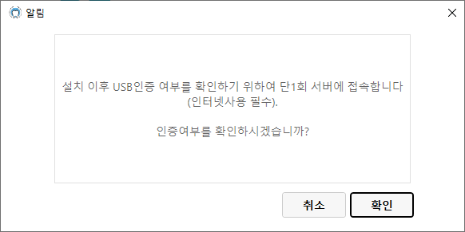
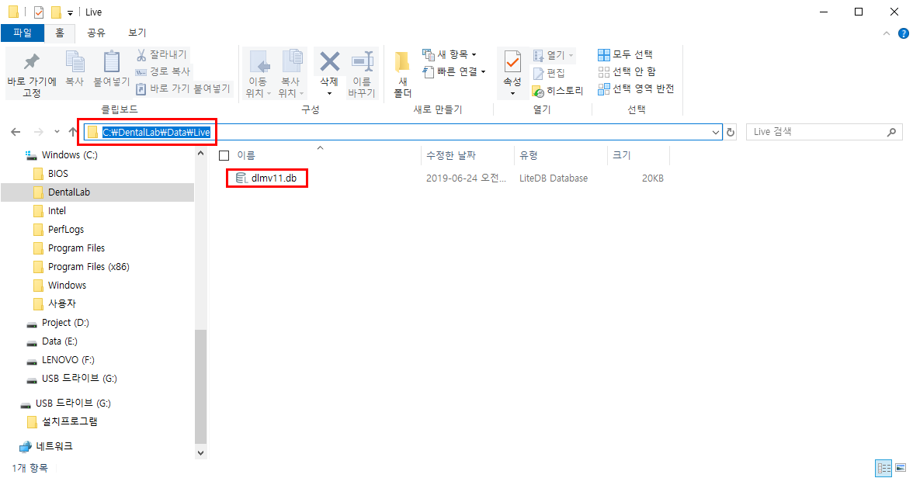

# 1.USB 인증 오류

* 최초 프로그램 설치를 USB에 첨부된 설치프로그램이 아닌 인터넷에서 다운로드 받아 설치할 경우 실행시 USB인증 오류가 발생합니다.
* 이럴 경우 아래의 순서대로 조치하시기 바랍니다.



## - USB에 첨부된 db파일 Copy
* [usb경로:]/dlmv11.db 


## - 프로그램 설치 위치에 붙여넣기
* 붙여넣기 위치 : C:\DentalLab\Data\Live\
* 기존 파일이 존재하면 덮어쓰기 하십시오


```yml
USB에서 파일 Copy : dlmv11.db 
```


